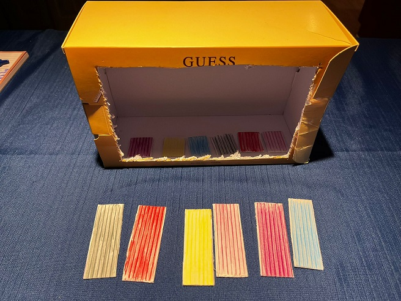
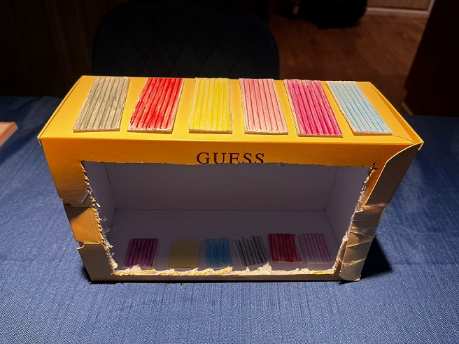
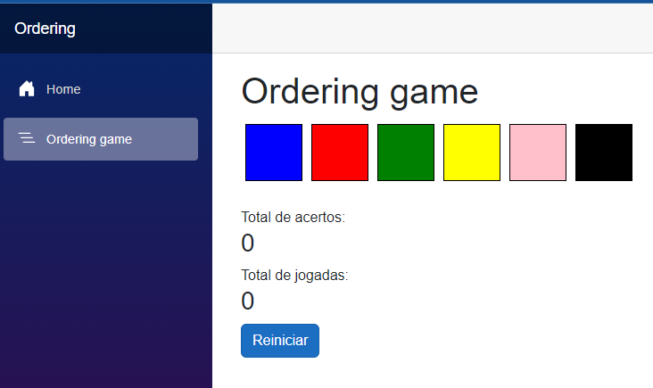
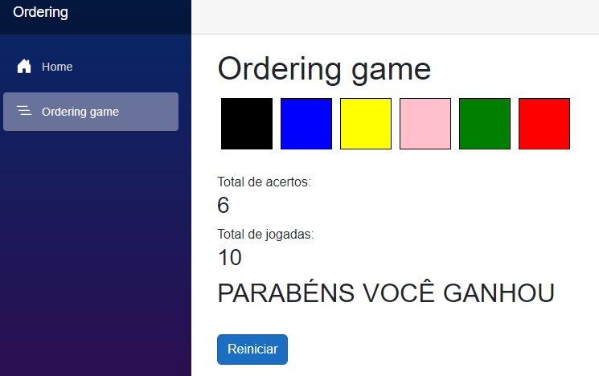

# OrderingGame

## Français

Ce projet est un jeu que j'ai créé pour ma fille. Le premier prototype était une boîte de parfum coupée avec 6 bâtons colorés que je mélangeais, et elle devait les remettre dans le bon ordre, qui était caché pour elle.  
Pour s'amuser, nous avons commencé à rivaliser pour voir qui pouvait remettre les couleurs dans le bon ordre avec le moins de mouvements.

Ensuite, j'ai décidé de créer un programme simple qu'elle pourrait utiliser sur l'iPad, et que ma femme et moi pourrions utiliser sur nos téléphones (ou ordinateurs) afin d'organiser un petit tournoi à la maison.

Le plus intéressant est qu'elle a commencé à proposer de petites améliorations, par exemple :  
- Un bouton de réinitialisation pour les cas où le joueur oublie la séquence ou le dernier mouvement et souhaite redémarrer la partie.  
- Modifier la couleur du bouton "Check", car il avait une couleur fixe et il était parfois difficile de le voir en fonction de la couleur principale.

### Fonctionnalités à venir
1. Permettre de définir le nombre de couleurs pour jouer.  
2. Ajouter un chronomètre pour voir combien de temps est nécessaire pour résoudre le problème.  
3. Permettre de jouer en ligne avec une autre personne pour voir qui résout la séquence le plus rapidement.  

---

## English

This project is a game I created for my daughter. The first prototype was a perfume box cut into 6 colored sticks, which I shuffled, and she had to put them back in the correct order, hidden from her view.  
As a fun activity, we started competing to see who could arrange them in the correct order with the fewest moves.

After that, I decided to create a simple program for her to use on the iPad, and for my wife and me to use on our phones (or PC) to hold a small tournament at home.

The most interesting part is that she started suggesting small improvements, such as:  
- A reset button for when the player forgets the sequence or the last move and wants to restart the match.  
- Changing the Check button's color, as it had a fixed color and was hard to see depending on the primary color.

### Upcoming Features
1. Allow specifying the number of colors to play with.  
2. Add a timer to see how long it takes to solve the problem.  
3. Enable online play with another person to see who solves the sequence faster.  
